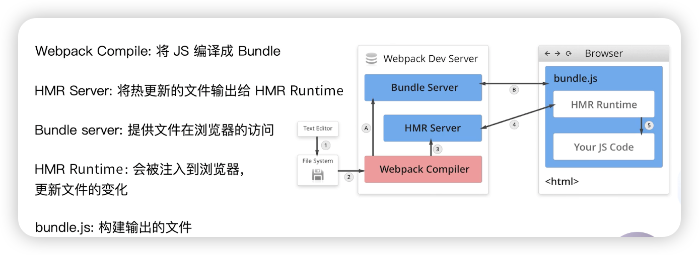

One line introduction about webpack: webpack is a module bundler. It takes modules with dependencies and generates static assets representing those modules.Just like: resources => js

## Five concepts: entry, output, loader, plugin, mode

1. entry: two different ways to config entry

```js
// single page
module.exports = {
  entry: './src/index.js',
}
```

```js
// multiple pages
module.exports = {
  entry: {
    page1: './src/page1.js',
    page2: './src/page2.js',
    // ...
  },
}
```

2. output: use `placeholder` to distinguish different entry files

```js
module.exports = {
  entry: {
    index: './src/index.js',
    search: './src/search.js',
  },
  output: {
    path: path.resolve(__dirname, 'dist'),
    filename: '[name].js', // [name] is the key of entry
  },
}
```

3. Loaders: just like a function, it can transform the file(css, jsx, ts, etc.) to js, there are many loaders, like:

```
babel-loader
css-loader
less-loader
ts-loader
file-loader
raw-loader
thread-loader
```

```js
module.exports = {
  module: {
    rules: [
      {
        test: /\.txt$/, // specify matching rules
        use: 'raw-loader', // specify the loader
      },
    ],
  },
}
```

4. Plugins: it can do more than loaders, it can do more things, like: bundle optimization, asset management, injection of environment variables, etc. There are many plugins, like:

```
CommonsChunkPlugin
CleanWebpackPlugin
ExtractTextWebpackPlugin
CopyWebpackPlugin
HtmlWebpackPlugin
UglifyjsWebpackPlugin
ZipWebpackPlugin
```

```js
module.exports = {
  plugins: [
    new HtmlWebpackPlugin({
      template: path.resolve(__dirname, 'src/index.html'),
    }),
  ],
}
```

5. Mode: webpack has two modes: production and development, the default mode is production, and the development mode is used for development, it will not minify the code, and it will add some useful tools for debugging.

production: set the value of process.env.NODE_ENV to production.Enabled by default: NamedChunksPlugin, NamedModulesPLugin.

development: set the value of process.env.NODE_ENV to development.Enabled by default: FlagDependencyUsagePlugin,FlagIncludedChunksPlugin,ModuleConcatenationPlugin, NoEmitOnErrorsPLugin, OccurrenceOrderPlugin,SideEffectsFlagPlugin,TerserPlugin

## Practice

1. How to resolve ES6 or JSX? You can use `babel-loader` with `@babel/preset-react` plugin.

```js
// .babelrc
{
  "presets": ["@babel/preset-env", "@babel/preset-react"]
}
```

```js
// webpack.config.js
module.exports = {
  module: {
    rules: [{ test: /\.js|/.jsx$/, use: 'babel-loader' }],
  },
}
```

2. How to resolve CSS/LESS? You can use `style-loader` and `css-loader` to resolve CSS. `style-loader` can inject `<style>` into the `<head>`, and `css-loader` can resolve CSS file and convert it to commonJS object. `less-loader` can convert less to css.

```js
// webpack.config.js
module.exports = {
  module: {
    rules: [
      {
        test: /\.css$/,
        use: ['style-loader', 'css-loader'], // the order is important, from right to left
      },
      {
        test: /\.less$/,
        use: ['style-loader', 'css-loader', 'less-loader'], // the order is important, from right to left
      },
    ],
  },
}
```

3. How to resolve images/font? You can use `file-loader`, `url-loader` to resolve images.

```js
module.exports = {
  module: {
    rules: [
      {
        test: /\.(png|jpg|jpeg|gif)$/,
        use: 'file-loader',
      },
      // in webpack 5, you can use asset/resource to replace file-loader
      //   {
      //     test: /\.(png|jpg|jpeg|gif)$/,
      //     type: 'asset/resource',
      //     generator: {
      //       filename: 'img/[name].[hash:8][ext]',
      //     },
      //   },
      // in webpack5, font can be resolved by default, but you still can config it
      {
        test: /\.(woff|woff2|eot|ttf|otf)$/,
        type: 'asset/resource',
        generator: {
          filename: 'font/[name].[hash:8][ext]',
        },
      },
    ],
  },
}
```

There is a bug in `file-loader`, it will generate a new file every time, even if the file is not changed. You can use `url-loader` to solve this problem. It can convert the file to base64 and inject it into the js file.

```js
module.exports = {
  module: {
    rules: [
      {
        test: /\.(png|jpg|jpeg|gif)$/,
        use: [
          {
            loader: 'url-loader',
            options: {
              limit: 10 * 1024, // 10kb, if the file is larger than 10kb, it will use file-loader to generate a new file, otherwise, it will convert the file to base64 and inject it into the js file.
            },
          },
        ],
      },
    ],
  },
}
```

In order to watch the file change, you can use `webpack watch` in package.json. If you change the file, it will automatically compile the file. But browser will not refresh automatically, you can use `webpack-dev-server` to solve this problem.

```json
{
  "scripts": {
    "watch": "webpack --watch"
  }
}
```

```json
// package.json
{
  "scripts": {
    "watch": "webpack --watch",
    "dev": "webpack-dev-server --open"
  }
}
```

```js
// webpack.config.js
const HtmlWebpackPlugin = require('html-webpack-plugin')
const webpack = require('webpack')

module.exports = {
  // ...
  mode: 'development',
  plugins: [
    new HtmlWebpackPlugin({
      template: 'src/index.html',
    }),
    new webpack.HotModuleReplacementPlugin(),
  ],
  devServer: {
    static: './dist',
    hot: true,
  },
}
```

If you want to control more options, you can use `webpack-dev-middleware` and `webpack-hot-middleware`. It can control more options, like: `publicPath`, `stats`, `serverSideRender`, etc.



## Hash

hash: it is the hash of the whole project, if you change any file, the hash will change.

chunkhash: it is the hash of the chunk, if you change the file, the hash will change.

contenthash: it is the hash of the content, if you change the content, the hash will change.

## Compression

html: html-webpack-plugin

```js
module.exports = {
  plugins: [
    new HtmlWebpackPlugin({
      template: 'src/index.html',
      filename: 'index.html',
      chunks: ['search'],
      inject: true,
      minify: {
        html5: true,
        collapseWhitespace: true,
        preserveLineBreaks: false,
        minifyCSS: true,
        minifyJS: true,
        removeComments: false,
      },
    }),
  ],
}
```

css: css-minimizer-webpack-plugin

```js
module.exports = {
  optimization: {
    minimize: true,
    minimizer: [
      // For webpack@5 you can use the `...` syntax to extend existing minimizers (i.e. `terser-webpack-plugin`), uncomment the next line
      // `...`,
      new CssMinimizerPlugin(),
    ],
  },
}
```

javascript: In Webpack5, It will be compress by default.

## Auto delete dist folder

```json
{
  "scripts": {
    "test": "echo \"Error: no test specified\" && exit 1",
    "build": "rm -rf ./dist && webpack --config webpack.prod.js",
    "watch": "rm -rf ./dist && webpack --watch",
    "dev": "rm -rf ./dist && webpack-dev-server --config webpack.dev.js"
  }
}
```

```js
// webpack.prod.js
{
  plugins: [new CleanWebpackPlugin()]
}
```

## CSS3 prefix

```js

```
